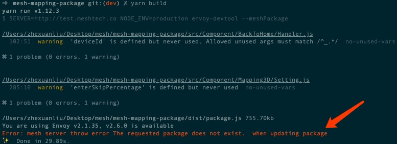
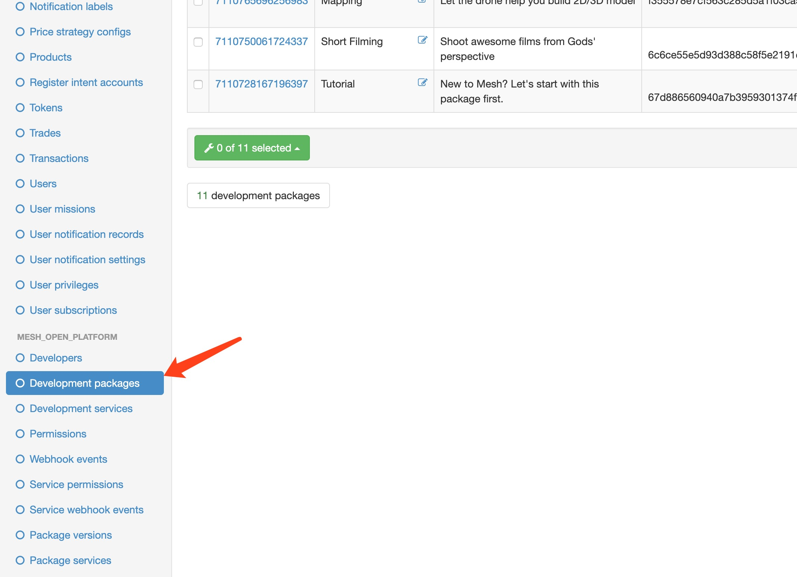
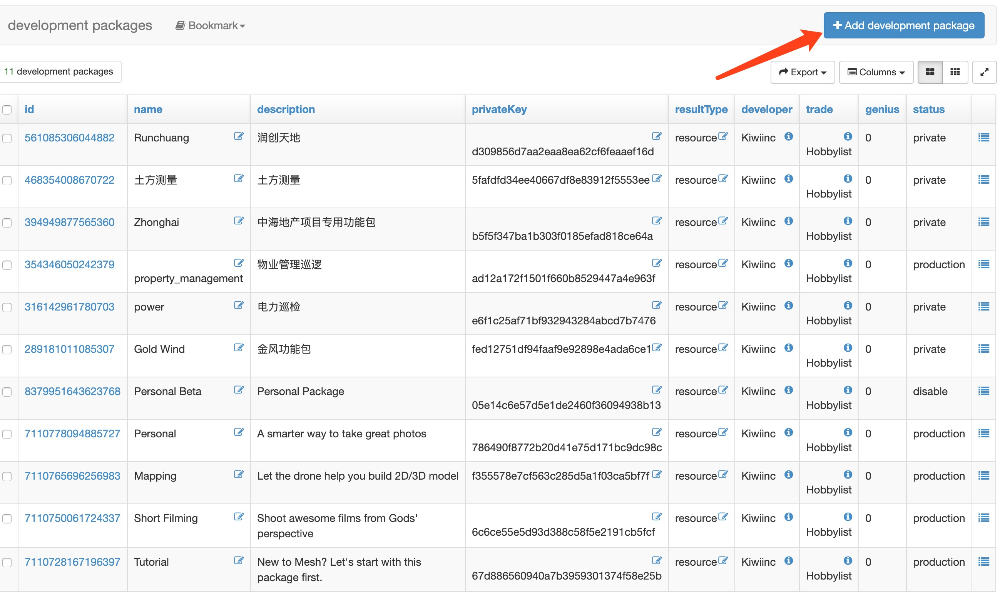

## Recap

- ~参会成员介绍~
- ~项目环境搭建及项目结构~
    - ~项目依赖讲解~
- 项目本地运行及部署
- 目前开发流程中不完善的地方
- FAQ


## 项目本地运行及部署
全都由 _mesh-dev-tool_ 中的脚本来完成
- 本地运行
- 发布和部署


## 本地运行


```bash
    yarn dev
```
- 清理当前项目目录 <!-- .element: class="fragment" data-fragment-index="1" -->
- babel 解析代码 <!-- .element: class="fragment" data-fragment-index="2" -->
- rollup 完成打包 <!-- .element: class="fragment" data-fragment-index="3" -->
    - 通过 rollup 设置好本地服务器端口，serve 该文件 <!-- .element: class="fragment" data-fragment-index="3" -->


## 项目本地运行及部署
全都由 _mesh-dev-tool_ 中的脚本来完成
- ~本地运行~
- 发布和部署


## 发布和部署


```bash
    yarn build      # 编译、打包并发布到测试服务器
    yarn build-pro  # 编译、打包并发布到正式服务器
```
- 清理当前项目目录 <!-- .element: class="fragment" data-fragment-index="1" -->
- babel 解析代码 <!-- .element: class="fragment" data-fragment-index="2" -->
- rollup 完成打包 <!-- .element: class="fragment" data-fragment-index="3" -->
    - ~通过 rollup 设置好本地服务器端口，serve 该文件~ <!-- .element: class="fragment" data-fragment-index="3" -->
- 上传至 qiniu <!-- .element: class="fragment" data-fragment-index="4" -->
- 将上传返回的链接更新至服务器的数据库 <!-- .element: class="fragment" data-fragment-index="5" -->


## Duhhhhh





你还需要去服务端进行配置


首先登陆
- 测试环境: http://test.meshtech.co/xadmin
- 正式环境(杭州): http://meshkit.cn/xadmin
- 正式环境(香港): http://meshtech.co/xadmin
- 没有账号的话，请找敬爱的亮哥给大家开通账号


- 找到 `DevelopmentPackages` 表格



- 点击添加按钮



### 填写表单
- Name 要跟 envoy.config.js 中的一致
- Trade 要选 `Hobbylist`
- Status 要选 production
- 其余随意


然后再跑一遍

```bash
    yarn build      # 编译、打包并发布到测试服务器
    yarn build-pro  # 编译、打包并发布到正式服务器
```