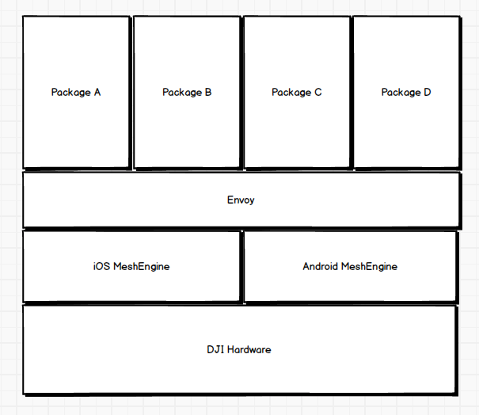
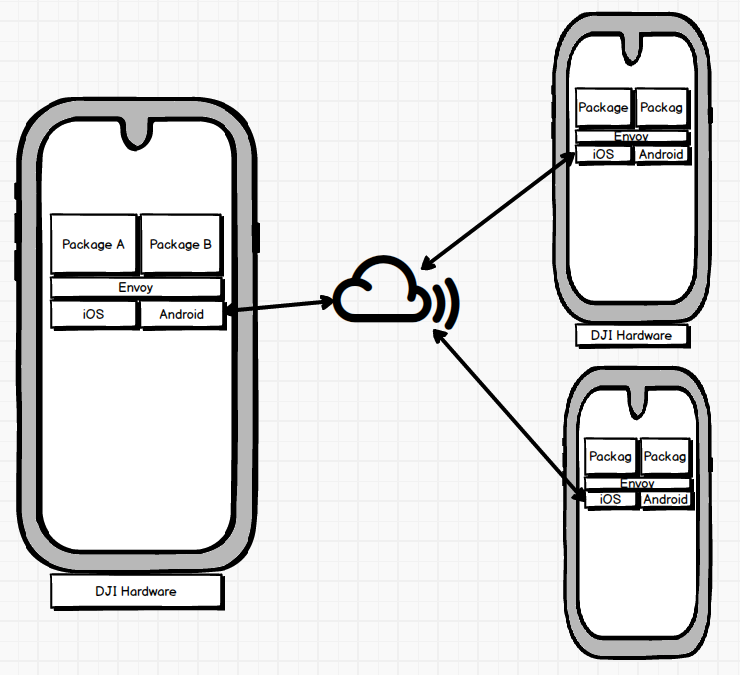

## 项目环境搭建及项目结构

主要围绕 MeshKit Packages 来进行阐述


## Overview
- MeshKit 的架构
- Package 项目的构建及项目结构


## MeshKit 的架构


### 在一台设备上





### 考虑多台设备...





## Recap
- ~MeshKit 的架构~
- Package 项目的构建及项目结构


## Package 项目的构建
- 配置文件
- 代码
- 输出
- 总结


### 配置文件
- package.json
- envoy.config.js
- .babelrc
- .jsconfig.json
- .eslintrc
- .gitignore
- lock????


### package.json
- 文件结构及每一项的意思 <!-- .element: class="fragment" data-fragment-index="1" -->
- dependencies <!-- .element: class="fragment" data-fragment-index="2" -->
- devDependencies <!-- .element: class="fragment" data-fragment-index="3" -->


### package.json - dependencies
[项目地址](http://dev.kiwiinc.net/kiwi-team/envoy)


### package.json - dependencies
- 由我司前端团队维护
    - mesh-envoy: 框架的核心 <!-- .element: class="fragment" data-fragment-index="1" -->
    - mesh-envoy-component: 定义框架中 component 的基类 <!-- .element: class="fragment" data-fragment-index="2" -->
    - mesh-envoy-devtool: 编译、打包、发布 package 的脚本 <!-- .element: class="fragment" data-fragment-index="3" -->
    - mesh-envoy-mobx: 在 envoy 中使用的基于 mobx 的封装 <!-- .element: class="fragment" data-fragment-index="4" -->
    - mesh-envoy-shared: 公有组件 <!-- .element: class="fragment" data-fragment-index="5" -->
- 其他开发成员也最好了解 <!-- .element: class="fragment" data-fragment-index="6" -->
    - mesh-envoy-tag: 封装好跟 iOS 约好的组件 <!-- .element: class="fragment" data-fragment-index="7" -->


### package.json - devDependencies
- babel
    - babel and Typescript? (Transpile and Compile)
    - [babeljs.io](https://babeljs.io/repl)
    - JSX - JavaScript XML
- eslint
- nodedemon


### 配置文件
- ~package.json~
- envoy.config.js
- .babelrc
- .jsconfig.json
- .eslintrc
- .gitignore
- lock????


### envoy.config.js
envoy 框架的配置
将来会被 `envoy-dev-tool` 来调用，包括
- package 的名字
- MeshEngine 的版本
- 上传 package 的参数


### .babelrc
- babel 的配置信息，我们内部统一制定
- [官方地址](http://babeljs.io)


### .eslintrc
- 统一开发格式，以及做一定程度的静态检查
- [官方地址](https://eslint.org)


### .gitignore
- 部分文件我们不希望被 push 到 git 上造成污染或者冲突


### lock????
- npm?? yarn??
- 什么是锁？
- 为什么要锁？


## Package 项目的构建
- ~配置文件~
- 代码
- 输出
- 总结


### 代码
- 都放在 `src/` 文件夹里
- 一个简单的 HelloWorld
- 后续分享会中详细讲解


## Package 项目的构建
- ~配置文件~
- ~代码~
- 输出
- 总结


### 输出

```
- dist/
- zip/
```


## Package 项目的构建
- ~配置文件~
- ~代码~
- ~输出~
- 总结


## 总结

```
- src/
- dist/
- zip/
- node_modules/
- package.json
- envoy.config.js
- .babelrc
- .jsconfig.json
- .eslintrc
- .gitignore
- lock
```
